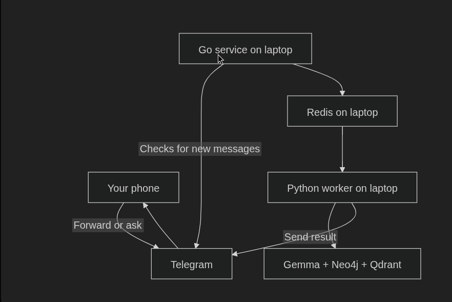

# Manthan

Manthan turns exported chat history into a searchable personal knowledge base. It filters low-signal messages, grades useful content with a locally hosted LLM, enriches shared links, and stores the resulting graph and embeddings in Neo4j and Qdrant.

The project is an early, working release intended for local use. The Python service is the core application; the Go Telegram bridge is optional.

## Open-source scope

This repository is prepared for public cloning and local self-hosting. It includes code, tests, example fixtures, and redacted aggregate metrics.

It does not include raw chat exports, generated message/link artifacts, local databases, or credentials. Those stay on the operator's machine and are ignored by default.

## Features

- Parses WhatsApp-style text exports, including multiline messages
- Filters media-only and other low-signal records before LLM processing
- Grades messages and extracts topics, entities, and link intent
- Scrapes web, GitHub, YouTube, and X links with manual-paste fallback
- Stores relationships in Neo4j and semantic vectors in Qdrant
- Supports resumable ingestion through SQLite checkpoints
- Exposes search, ingestion, pending-link, and Prometheus endpoints through FastAPI
- Accepts new messages and queries through an optional private Telegram bot

## Measured pipeline run

The following is actual data from the privacy-safe report in [python-ingestion/metrics/manthan_report.md](python-ingestion/metrics/manthan_report.md), generated on 18 August 2026. The source chat name and message contents are not published.

| Metric | Result |
| --- | ---: |
| Messages parsed | 146 |
| Messages kept for grading | 131 |
| Messages dropped heuristically | 15 (10.3%) |
| Quality distribution (1 / 2 / 3 / 4 / 5) | 5 / 19 / 16 / 66 / 25 |
| Mean grading confidence | 0.893 |
| Enriched records | 49 |
| Links extracted | 57 |
| Scraped link records | 35 |
| LLM calls | 122 |
| Prompt / completion tokens | 241,019 / 23,694 |
| Total LLM tokens | 264,713 |
| LLM wall time | 772.837 s |
| Neo4j nodes / relationships | 114 / 116 |
| Qdrant points / vector dimensions | 16 / 384 |

These measurements describe one local run, not a benchmark across hardware or models. The report also contains the category breakdown, link outcomes, latency, and storage counts.

## Repository layout

- `python-ingestion/`: parser, grading, enrichment, storage, API, Drive sync (`drive_changes.py`, `drive_watch.py`, `drive_event_listener.py`), scripts, and tests
- `drive-relay/`: Azure Function relay (`relay.py`, `publisher.py`, `function_app.py`) that turns Google Drive push notifications into Service Bus events, plus its tests
- `golang-telegram/`: optional Telegram-to-Redis bridge
- `docker-compose.yaml`: local Neo4j, Qdrant, and Redis services
- `python-ingestion/metrics/`: redacted public reports generated from local runs

## System architecture

1. `parser.py` reads an exported chat file.
2. `heuristic_filter.py` removes obvious noise.
3. `grader.py` scores messages and extracts structured metadata with the configured local LLM.
4. `enrich.py` and `link_scraper.py` retrieve and summarize linked resources.
5. `store.py` and `vector_store.py` write to Neo4j and Qdrant.
6. `app.py` exposes the stored knowledge through HTTP endpoints.
7. Drive automatic ingestion: `drive_watch.py` registers a Google `changes.watch` channel; Google pushes to the `drive-relay` Function (`relay.py` validates, `publisher.py` sends to Service Bus); `drive_event_listener.py` receives the event and calls `notify_drive_change()`; `drive_changes.py` fetches unseen changes and `run_incremental_import()` ingests only new messages.



## Requirements

- Python 3.12 or 3.13
- [`uv`](https://docs.astral.sh/uv/)
- Docker with Compose
- A local OpenAI-compatible chat-completions endpoint, such as `llama.cpp`
- Go 1.25 or newer for the optional Telegram bridge
- Several GB of free disk space for Python dependencies, Chromium, and the default embedding model

The embedding model is downloaded on first use. Link enrichment also makes outbound requests to the URLs being processed. GitHub and YouTube are accessed directly; Supadata is an optional YouTube transcript fallback.

## Quick start

Clone the repository and create a local configuration:

```bash
git clone https://github.com/MayankDew08/manthan.git
cd Manthan
cp .env.example .env
cp python-ingestion/.env.example python-ingestion/.env
cp drive-relay/local.settings.example.json drive-relay/local.settings.json
```

Edit `.env` and set `NEO4J_PASSWORD` to a new local password. Then edit `python-ingestion/.env` and set:

- `LLAMA_BASE_URL` to the base URL of your OpenAI-compatible local server
- `LLAMA_MODEL` to the model name accepted by that server
- `NEO4J_PASSWORD` to the same local password

Start Neo4j, Qdrant, and Redis. Compose reads the root `.env`, so keep both passwords in sync:

```bash
make dbs
```

Install Python dependencies and the Chromium runtime used by the scraper:

```bash
cd python-ingestion
uv sync --locked
uv run playwright install chromium
```

Start the API in the background on the local interface:

```bash
make server-python
```

Open <http://127.0.0.1:8000/docs> for the interactive API documentation, or check the service with:

```bash
curl http://127.0.0.1:8000/health
```

### Ingest a chat export

From `python-ingestion/`, pass the path to a WhatsApp-style UTF-8 text export:

```bash
uv run python main.py /absolute/path/to/chat-export.txt
```

The pipeline writes resumable checkpoints and generated JSON artifacts locally. These files, source chat exports, search-evaluation artifacts, database files, and `.env` files are excluded by `.gitignore`. The chat file under `tests/` is a synthetic fixture.

### Search and inspect data

The primary endpoints are:

| Method | Endpoint | Purpose |
| --- | --- | --- |
| `GET` | `/health` | Readiness check |
| `POST` | `/search` | Hybrid graph and semantic search |
| `POST` | `/ingest` | Queue a chat-file ingestion job |
| `GET` | `/jobs/{job_id}` | Inspect ingestion status |
| `POST` | `/ingest-message` | Ingest one message |
| `GET` | `/messages` | Filter stored messages |
| `GET` | `/links/pending` | List links needing pasted content |
| `POST` | `/links/paste` | Supply content for a blocked link |
| `GET` | `/metrics` | Prometheus metrics |

The API currently has no authentication. Keep it bound to `127.0.0.1` or place it behind authentication before exposing it to another machine.

### Regenerate a public metrics report

The generator reads local run artifacts and storage statistics. It redacts the source path by default:

```bash
uv run python scripts/metrics_report.py \
  --chat /absolute/path/to/chat-export.txt \
  --out metrics/manthan_report.md
```

Use `--chat-label` only for a label that is safe to publish. Always review generated reports before committing them.

## Run the complete Telegram stack

The bot is a multi-process local stack managed by `make`: Compose runs Neo4j, Qdrant, and Redis together; FastAPI owns the search and ingestion API; two Python workers consume Redis streams; and the Go process polls Telegram. Start them in the order below so every process finds its dependencies ready. The OpenAI-compatible local LLM configured in `python-ingestion/.env` must also be listening before you send ingestion jobs.

First, configure the bridge. Use the same `TELEGRAM_BOT_TOKEN` in `golang-telegram/.env` and `python-ingestion/.env`; set `ALLOWED_TELEGRAM_USER_ID` only in the Go configuration.

```bash
cp golang-telegram/.env.example golang-telegram/.env
# Edit all .env files before continuing.
```

1. Start the backing services (Neo4j, Qdrant, Redis) from the repository root:

   ```bash
   make dbs
   ```

2. Start FastAPI, both workers, and the Go Telegram bridge:

   ```bash
   make server-python
   make workers
   make server-go
   ```

Every process runs in the background, writes to a log under `logs/`, and records its PID under `.run/`. Re-running any target is safe — it skips processes that are already alive.

Check progress with:

```bash
tail -f logs/bot.log logs/worker-query.log logs/worker-ingest.log
```

Only the configured Telegram user ID is accepted by the bot. Telegram messages necessarily pass through Telegram's service; this optional workflow is not fully local. Stop the application processes with `make stop` (Compose containers are untouched), then stop the backing services with:

```bash
make dbs-down
```

## Drive automatic ingestion

WhatsApp exports stored as ZIPs in a Google Drive folder can be ingested automatically. Google notifies the relay, the relay wakes the local listener, and only unseen messages enter the pipeline. The Drive folder ID stays local; the public relay only carries channel metadata.

### Configure

Set these in `python-ingestion/.env` (all local, never committed):

| Variable | Purpose |
| --- | --- |
| `DRIVE_FOLDER_ID` | Google Drive folder holding the export ZIPs (from the folder URL) |
| `DRIVE_CHANNEL_TOKEN` | Secret shared with Google `changes.watch` and the relay Function |
| `INSTALLATION_ID` | Stable ID of this laptop/agent (for example `manthan-mayank-01`) |
| `SERVICE_BUS_NAMESPACE` / `SERVICE_BUS_QUEUE` | Azure Service Bus endpoint and queue |
| `MANTHAN_IMPORT_DB` | Local SQLite state file (`import_state.sqlite`) |
| `DRIVE_LISTENER_DRY_RUN` | `true` prints notifications without running Drive sync or Gemma |

Copy `drive-relay/local.settings.example.json` to `drive-relay/local.settings.json` for local Function runs. The real `DRIVE_CHANNEL_TOKEN` lives only in Azure app settings, never in the repo.

### Run the change tracker manually

```bash
cd python-ingestion
uv run python drive_changes.py init    # save the Drive page token once
uv run python drive_changes.py check   # report relevant changed ZIPs, advance position
uv run python drive_watch.py create    # register the Google push channel
uv run python drive_watch.py status    # inspect the stored watch record
uv run python drive_event_listener.py  # receive Service Bus events and sync
```

`sync_import_relevant_changes()` downloads each relevant ZIP, extracts the single `.txt` export, and calls `run_incremental_import()`, which processes only unseen messages (same-revision exports are skipped without LLM calls). The page token advances only after every file in a batch succeeds; on failure the old token is retained and the error recorded, so retries skip already-imported work via revision and message-ID checks.

### Tests

```bash
cd python-ingestion
uv run pytest tests/test_drive_changes.py tests/test_drive_watch.py tests/test_drive_event_listener.py -q

cd ../drive-relay
uv run pytest tests -q   # relay validation, publishers, Function wrapper (all mocked, no Azure needed)
```

## Development

Run the existing offline Python suite and the Go checks:

```bash
cd python-ingestion
uv run python tests/run_tests.py

cd ../golang-telegram
go test ./...
go vet ./...
```

When contributing, keep changes focused, add tests for behavior changes, avoid committing generated or personal data, and run both check sets. Bug reports and focused pull requests are welcome on [GitHub Issues](https://github.com/MayankDew08/manthan/issues) and [pull requests](https://github.com/MayankDew08/manthan/pulls).

## Privacy and security

- LLM inference is local when `LLAMA_BASE_URL` points to a local server.
- Link enrichment contacts external websites and may use optional configured APIs.
- Raw chats, derived records, checkpoints, local databases, tokens, and environment files must remain untracked.
- The Google Drive channel token lives only in Azure app settings and local `local.settings.json` (both ignored); it is never logged, stored in SQLite, or returned in relay events.
- The checked-in metrics report contains aggregate values only and uses a redacted source label.
- The API has no built-in auth; keep it on `127.0.0.1` unless you add your own access control.
- Rotate any credential immediately if it is ever committed or shared.

## License

Manthan is available under the [MIT License](LICENSE).
